```mermaid
gantt
    title DT Pipeline — 2026-02-13T10:00:00Z
    dateFormat HH:mm:ss
    axisFormat %H:%M:%S

    section Pipeline
    DT1 [SUCCEEDED]                          :done,   dt1, 10:01:00, 10:01:30
    DT2 [SUCCEEDED]                          :done,   dt2, 10:01:31, 10:02:00
    DT3 [FAILED]                             :crit,   dt3, 10:02:01, 10:02:20
    DT4 [SKIPPED — UPSTREAM_FAILURE]         :active, dt4, 10:02:20, 10:02:21
```

# Pipeline Diagnostics

Diagnose dynamic table pipeline execution using OpenTelemetry traces stored in the event table. Generate Gantt charts, identify root causes of failures and skips, and analyze critical paths.

## When to Load

Main skill routes here when user asks about:
- Pipeline execution timelines or Gantt charts
- Why a DT was skipped (UPSTREAM_FAILURE, UPSTREAM_SKIP, NOT_EFFECTIVE_TICK_TO_REFRESH)
- Root cause analysis across a pipeline
- Critical path or bottleneck analysis
- What DTs were affected by a failure
- Pipeline-wide execution visualization

---

## Span Data Model

DT pipeline spans are stored in the event table with span name `table_refresh`.

**Top-level columns:** `START_TIMESTAMP`, `TIMESTAMP` (end), `RECORD_TYPE`, `record`

**Trace identifiers** (inside the `TRACE` variant column):
- `trace:"trace_id"::STRING` — trace ID (shared by all spans in the same pipeline refresh cycle)
- `trace:"span_id"::STRING` — unique span ID for this span

**Resource attributes** (`RESOURCE_ATTRIBUTES`):
- `snow.executable.name` — DT name (uppercase short name, e.g., `DT1`; use `snow.database.name` and `snow.schema.name` to construct the fully qualified name)
- `snow.executable.type` — `DYNAMIC_TABLE`
- `snow.database.name`, `snow.schema.name`
- `snow.warehouse.name`, `snow.query.id`

**Span attributes** (`RECORD_ATTRIBUTES`):
- `snow.dynamic_table.data_timestamp` — the target data freshness timestamp for this refresh cycle (shared by all DTs evaluated together in the same pipeline refresh)
- `snow.dynamic_table.state` — `SUCCEEDED`, `FAILED`, or `SKIPPED`
- `snow.dynamic_table.state_reason` — reason code (e.g., `QUERY_FAILURE`, `UPSTREAM_FAILURE`, `UPSTREAM_SKIP`, `NOT_EFFECTIVE_TICK_TO_REFRESH`)

**Span links** (`record:"links"`):
- JSON array of `{"span_id": "...", "trace_id": "..."}` objects
- Each link points to an upstream dependency's span, encoding the pipeline DAG
- To resolve dependencies, join link `span_id` values back to other spans in the pipeline

**Important behavioral details:**

- Skipped DTs have zero-duration spans (`START_TIMESTAMP == TIMESTAMP`).
- Only customer-actionable skip reasons emit spans: `UPSTREAM_FAILURE`, `UPSTREAM_SKIP`, `NOT_EFFECTIVE_TICK_TO_REFRESH`. Internal skip reasons (`RUNNING_INSTANCE`, `TABLE_NOT_FOUND`) do NOT produce spans.
- Tracing requires both `FEATURE_DT_TRACING` (account-level) and `TRACE_LEVEL = ALWAYS` (per DT).

**Skip reason priority ordering:** When a DT has multiple upstream dependencies with different issues, the highest-priority skip reason wins. Priority (lowest → highest):

`INPUTS_NOT_REFRESHED` < `TABLE_NOT_FOUND` < `RUNNING_INSTANCE` < `NOT_EFFECTIVE_TICK_TO_REFRESH` < `UPSTREAM_SKIP` < `UPSTREAM_FAILURE`

Example: In a diamond topology where one upstream fails and another is skipped, the DT shows `UPSTREAM_FAILURE` (highest priority). Mention this when the user asks why a particular skip reason was chosen.

---

## Workflow

### Step 0: Discover Event Table and Check Prerequisites

**Goal:** Locate the event table and verify tracing is enabled.

1. **Find event table** — load [observability-external/event-table/event-table-get-setup/SKILL.md](../../../observability-external/event-table/event-table-get-setup/SKILL.md) and follow its Step 1 workflow to discover which event table is active for the DT's database. This handles account-level defaults vs. database-level overrides.

   **⚠️ STOPPING POINT**: If no event table is found, ask the user for the event table name.

2. **Check tracing is enabled** on the target DT:
   ```sql
   SHOW PARAMETERS LIKE 'TRACE_LEVEL' IN TABLE <db.schema.dt_name>;
   ```

   **If TRACE_LEVEL is not `ALWAYS`:**

   Recommend the narrowest scope first. If the user lacks privileges, suggest the next level up or ask them to contact their admin.

   | Scope | Statement | Privilege Required |
   |-------|-----------|-------------------|
   | Single DT | `ALTER DYNAMIC TABLE <dt> SET TRACE_LEVEL = 'ALWAYS'` | OPERATE on the DT |
   | All DTs in schema | `ALTER SCHEMA <schema> SET TRACE_LEVEL = 'ALWAYS'` | OWNERSHIP on the schema |
   | All DTs in database | `ALTER DATABASE <db> SET TRACE_LEVEL = 'ALWAYS'` | OWNERSHIP on the database |
   | Account-wide | `ALTER ACCOUNT SET TRACE_LEVEL = 'ALWAYS'` | ACCOUNTADMIN role |

   **⚠️ Scope and cost considerations:** Enabling tracing at a broader scope (schema, database, or account) turns on span emission for **all** objects in that scope, not just the target DT. This increases event table ingestion volume, which incurs storage and compute costs. Recommend starting with the narrowest scope (only the DTs associated with the pipeline of concern) and only widening if the user needs schema-wide or database-wide visibility across many DTs. Always inform the user of this trade-off before they enable tracing at a broad scope.

   - Tell the user: "DT pipeline tracing is not enabled. To enable it, run `ALTER DYNAMIC TABLE <dt_name> SET TRACE_LEVEL = 'ALWAYS';` (requires OPERATE privilege). Spans will appear after the next refresh. In the meantime, I can use refresh history as a fallback."
   - If enabling at schema/database level, warn the user: "This will enable tracing for all objects in the schema/database, which increases event ingestion volume and associated costs. If you only need to trace a specific DT, consider enabling it at the DT level instead."
   - If user lacks privileges, suggest they contact their admin with the appropriate statement from the table above.
   - **Fall back** to `DYNAMIC_TABLE_REFRESH_HISTORY()` (see Fallback section).

---

### Step 1: Find the Span

**Goal:** Locate the span for the user's DT near the time they specified.

```sql
SELECT
  trace:"span_id"::STRING AS span_id,
  RESOURCE_ATTRIBUTES:"snow.executable.name"::STRING AS dt_name,
  RESOURCE_ATTRIBUTES:"snow.database.name"::STRING AS db_name,
  RESOURCE_ATTRIBUTES:"snow.schema.name"::STRING AS schema_name,
  RECORD_ATTRIBUTES:"snow.dynamic_table.data_timestamp"::STRING AS data_timestamp,
  RECORD_ATTRIBUTES:"snow.dynamic_table.state"::STRING AS dt_state,
  RECORD_ATTRIBUTES:"snow.dynamic_table.state_reason"::STRING AS state_reason,
  RESOURCE_ATTRIBUTES:"snow.query.id"::STRING AS query_id,
  RESOURCE_ATTRIBUTES:"snow.warehouse.name"::STRING AS warehouse,
  START_TIMESTAMP,
  TIMESTAMP AS end_timestamp
FROM <event_table>
WHERE RECORD_TYPE = 'SPAN'
  AND record:"name" = 'table_refresh'
  AND RESOURCE_ATTRIBUTES:"snow.database.name" = '<DATABASE>'
  AND RESOURCE_ATTRIBUTES:"snow.schema.name" = '<SCHEMA>'
  AND RESOURCE_ATTRIBUTES:"snow.executable.name" = '<DT_NAME>'
  AND START_TIMESTAMP >= DATEADD('minute', -30, CURRENT_TIMESTAMP())  -- see note below
ORDER BY START_TIMESTAMP DESC
LIMIT 5;
```

**Time window:** Default to a 30-minute lookback from `CURRENT_TIMESTAMP()` when the user doesn't specify a time. If the user references a specific time (e.g., "yesterday at 3pm"), replace with a window around that time: `START_TIMESTAMP BETWEEN '<time>'::TIMESTAMP - INTERVAL '10 minutes' AND '<time>'::TIMESTAMP + INTERVAL '10 minutes'`.

**Important:** Always filter by `snow.database.name` and `snow.schema.name` in addition to `snow.executable.name`. The event table is account-wide and may contain spans from DTs with the same short name in different databases or schemas.

Extract `data_timestamp` from the matching result.

**⚠️ STOPPING POINT**: If no spans are found, tracing may not be enabled at the account level, or no refreshes occurred in the queried range. **Fall back** to `DYNAMIC_TABLE_REFRESH_HISTORY()`.

---

### Step 2: Get the Full Pipeline

**Goal:** Retrieve all DT spans for the same pipeline refresh cycle, including span links for dependency resolution.

```sql
SELECT
  trace:"span_id"::STRING AS span_id,
  RESOURCE_ATTRIBUTES:"snow.executable.name"::STRING AS dt_name,
  RESOURCE_ATTRIBUTES:"snow.database.name"::STRING AS db_name,
  RESOURCE_ATTRIBUTES:"snow.schema.name"::STRING AS schema_name,
  RECORD_ATTRIBUTES:"snow.dynamic_table.data_timestamp"::STRING AS data_timestamp,
  RECORD_ATTRIBUTES:"snow.dynamic_table.state"::STRING AS dt_state,
  RECORD_ATTRIBUTES:"snow.dynamic_table.state_reason"::STRING AS state_reason,
  RESOURCE_ATTRIBUTES:"snow.query.id"::STRING AS query_id,
  RESOURCE_ATTRIBUTES:"snow.warehouse.name"::STRING AS warehouse,
  START_TIMESTAMP,
  TIMESTAMP AS end_timestamp,
  DATEDIFF('second', START_TIMESTAMP, TIMESTAMP) AS duration_sec,
  record:"links" AS upstream_links
FROM <event_table>
WHERE RECORD_TYPE = 'SPAN'
  AND record:"name" = 'table_refresh'
  AND RECORD_ATTRIBUTES:"snow.dynamic_table.data_timestamp" = '<data_timestamp>'
ORDER BY START_TIMESTAMP ASC;
```

Returns one row per DT in the pipeline for that refresh cycle. The `upstream_links` column contains the span link array encoding the pipeline DAG.

**If only one row returned:** The DT is standalone (not part of a pipeline). Provide single-DT diagnostics instead, use TROUBLESHOOT skill.

**If empty:** No spans exist for this `data_timestamp`. Tracing may not have been enabled at the time, or the `data_timestamp` is incorrect. If `data_timestamp` cannot be resolved, fall back to `DYNAMIC_TABLE_REFRESH_HISTORY()`.

---

### Step 3: Visualize

**Goal:** Generate a Mermaid Gantt chart color-coded by outcome.

**Map `snow.dynamic_table.state` to Mermaid styles:**

| State | Mermaid Style | Color |
|-------|---------------|-------|
| SUCCEEDED | `done` | Green |
| SKIPPED | `active` | Yellow |
| FAILED | `crit` | Red |

**Label formatting:**
- SUCCEEDED: `<DT_SHORT_NAME> [SUCCEEDED]`
- FAILED: `<DT_SHORT_NAME> [FAILED]`
- SKIPPED: `<DT_SHORT_NAME> [SKIPPED — <state_reason>]`

Use short DT names (without database.schema prefix) for readability. If multiple DTs in the pipeline share the same short name (from different schemas), use `<SCHEMA>.<DT_NAME>` to disambiguate. For skipped DTs (zero-duration spans), add 1 second so they render visibly.

**Example output:**

~~~

~~~

---

### Step 4: Diagnose (If Asked)

**Goal:** Use span links to resolve the pipeline DAG and explain causality.

The pipeline topology is encoded via OTel span links, not a named attribute. Each span's `record:"links"` contains references to its upstream dependency spans by `span_id`. To resolve the dependency graph, join link `span_id` values back to `trace:"span_id"` of other pipeline spans from Step 2.

**Resolve upstream dependencies for a specific DT:**

```sql
WITH pipeline AS (
  SELECT
    trace:"span_id"::STRING AS span_id,
    RESOURCE_ATTRIBUTES:"snow.executable.name"::STRING AS dt_name,
    RECORD_ATTRIBUTES:"snow.dynamic_table.state"::STRING AS dt_state,
    RECORD_ATTRIBUTES:"snow.dynamic_table.state_reason"::STRING AS state_reason,
    record:"links" AS upstream_links
  FROM <event_table>
  WHERE RECORD_TYPE = 'SPAN'
    AND record:"name" = 'table_refresh'
    AND RECORD_ATTRIBUTES:"snow.dynamic_table.data_timestamp" = '<data_timestamp>'
),
target_links AS (
  SELECT f.value:"span_id"::STRING AS upstream_span_id
  FROM pipeline,
  LATERAL FLATTEN(input => upstream_links) f
  WHERE dt_name = '<target_dt_name>'
)
SELECT
  p.dt_name AS upstream_dt,
  p.dt_state AS upstream_state,
  p.state_reason AS upstream_reason
FROM target_links tl
JOIN pipeline p ON tl.upstream_span_id = p.span_id;
```

**Find downstream DTs affected by a specific DT's failure:**

```sql
WITH pipeline AS (
  -- ... same CTE as above ...
)
SELECT p.dt_name, p.dt_state, p.state_reason
FROM pipeline p,
LATERAL FLATTEN(input => p.upstream_links) f
WHERE f.value:"span_id"::STRING = '<target_span_id>';
```

This returns DTs that directly depend on the target. Recurse to find transitive downstream impact.

**Diagnostic workflows:**

**"Why was DT skipped/failed?"**
1. Read target DT's `dt_state` and `state_reason` from Step 2 results.
2. If `UPSTREAM_FAILURE` or `UPSTREAM_SKIP`, resolve upstream deps using the span link query above.
3. For each upstream DT that is FAILED or SKIPPED, repeat the link resolution to trace further upstream.
4. Continue until reaching a root cause (e.g., `QUERY_FAILURE` on a FAILED span).
5. Summarize: "DT4 was skipped (UPSTREAM_FAILURE) because its upstream dependency DT3 failed with QUERY_FAILURE (query_id: `<id>`)."
6. If the DT has multiple upstream deps (diamond topology), note that skip reason priority applies — `UPSTREAM_FAILURE` takes precedence over `UPSTREAM_SKIP`.

**"What was affected by X's failure?"**
1. Use the downstream query above to find direct dependents of the failed DT.
2. Recurse through those DTs' downstream dependents.
3. Report all downstream DTs with SKIPPED or cascading FAILED status.
4. **Note:** If a downstream DT is absent from the event table (e.g., tracing not enabled on it, or spans not yet ingested), fall back to `DYNAMIC_TABLE_GRAPH_HISTORY()` to discover the full dependency graph.

**"What was the slowest DT?"**
1. Filter to SUCCEEDED spans from Step 2 results.
2. Sort by `duration_sec` descending and report.

**"What is the critical path?"**
1. Build the DAG from span links (resolve all upstream links to DT names).
2. For each DT, compute the longest path from a root (no upstream links) to that DT, summing durations.
3. The path with the largest total is the critical path.

### After Diagnosis: Fixing the Issue

This skill handles **diagnosis only**. Once the root cause is identified (e.g., a FAILED upstream DT with `QUERY_FAILURE`), load [troubleshoot/SKILL.md](../troubleshoot/SKILL.md) to execute the fix — it has workflows for resuming suspended DTs, fixing change tracking, resolving refresh errors, and verifying recovery.

---

## Cross-Database Trace Stitching

DTs in different databases may emit spans to different event tables. All spans in the same pipeline refresh cycle share the same `trace:"trace_id"`, even when stored in separate event tables.

**Detection:** After Step 2, resolve span links. If an upstream `span_id` from a link doesn't match any span in the current result set, the upstream DT is likely in a different database.

**Resolution:**
1. From Step 2 results, identify any unresolved link `span_id` values.
2. Use known DT names or `DYNAMIC_TABLE_GRAPH_HISTORY()` to identify the upstream database.
3. Discover that database's event table:
   ```sql
   SHOW PARAMETERS LIKE 'EVENT_TABLE' IN DATABASE <upstream_database>;
   ```
4. Query the upstream event table using the same `snow.dynamic_table.data_timestamp`.
5. Merge results in memory to reconstruct the full pipeline.

---

## Fallback: No Tracing Available

When tracing is not enabled or no spans exist, fall back to per-DT refresh history:

```sql
SELECT
  name,
  state,
  state_code,
  state_message,
  refresh_start_time,
  refresh_end_time,
  DATEDIFF('second', refresh_start_time, refresh_end_time) AS duration_sec,
  query_id
FROM TABLE(INFORMATION_SCHEMA.DYNAMIC_TABLE_REFRESH_HISTORY(
  NAME => '<fully_qualified_name>'))
ORDER BY refresh_start_time DESC
LIMIT 10;
```

This provides single-DT history only. Pipeline-wide timeline and dependency analysis require tracing to be enabled.

---

## Stopping Points

- ✋ Step 0: No event table found → ask user for event table name
- ✋ Step 0: TRACE_LEVEL not ALWAYS → instruct user to enable, offer fallback
- ✋ Step 1: No spans found → explain possible causes, offer fallback
- ✋ Step 2: Single row → DT is standalone, provide single-DT diagnostics
- ✋ Step 2: Empty result → no spans for this timestamp, fall back to refresh history
- ✋ Step 4: Root cause identified and fix needed → load troubleshoot/SKILL.md

**Resume rule:** After any fallback, continue with the best available data source.
